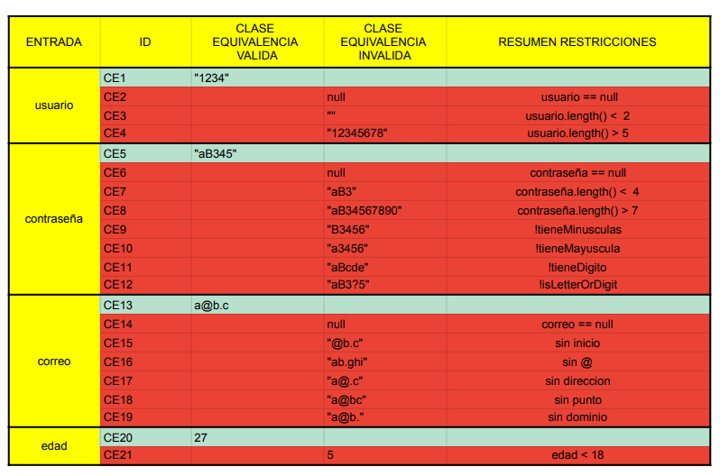
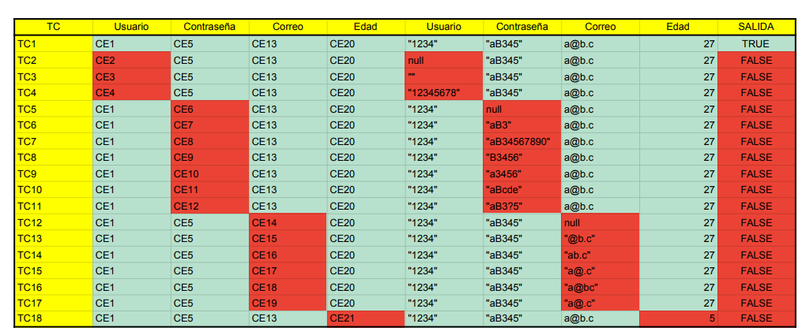
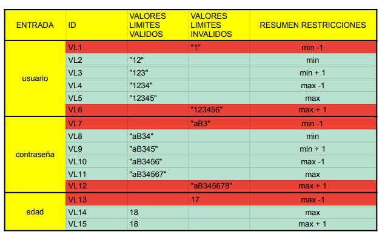
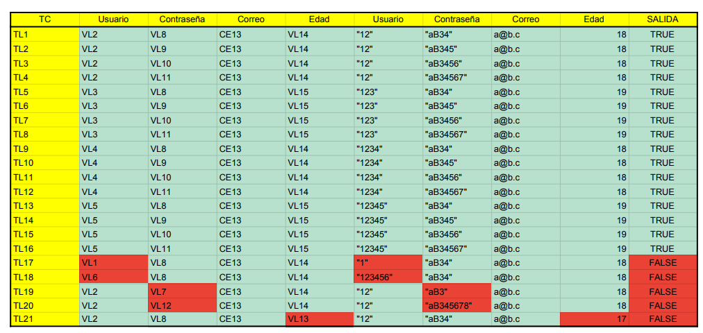

<!-- Enlace al PDF centrado -->

  <a href="src/main/resources/TEST_USUARIO_OFICIAL.pdf">
    <b>📄 Ver TEST_USUARIO_OFICIAL.pdf</b>
  </a>

<!-- Imágenes centradas y una debajo de otra -->

  
    
  
    
  
    
  

